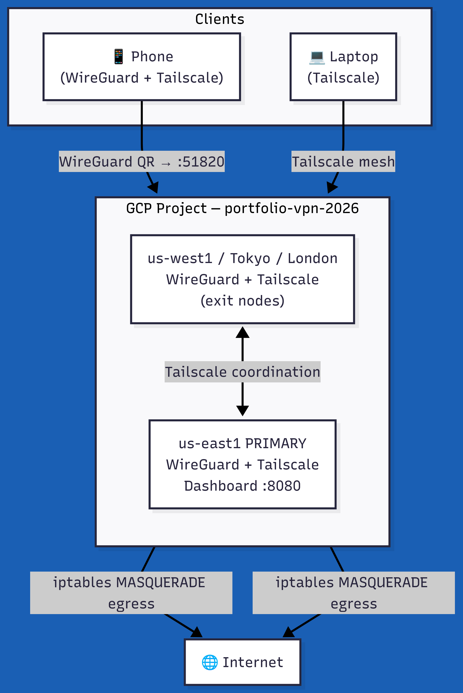

# Architecture

## Diagram

```
INTERNET
    |
    v
Cloud Firewall (Allow UDP 51820 only)
    |
    v
e2-micro VM (us-east1) — FREE TIER
WireGuard VPN Server
    |
    v
Custom VPC (10.0.0.0/24)
Subnet: 10.0.0.0/28
Private Google Access: ON
```

### Current as-built



## Components

### Custom VPC (`vpn-vpc`)
- **Custom mode**, not auto-mode. Auto-mode creates a subnet in every GCP
  region, expanding the attack surface and inviting accidental cost.
  Custom mode = one subnet, one region, full control.
- Regional routing (no need for global route exchange).

### Subnet (`vpn-subnet`, 10.0.0.0/28)
- 16 addresses (11 usable) — deliberately small; a VPN server needs one IP.
- **Private Google Access: ON** — future internal VMs can reach GCP APIs
  (storage, logging) without public IPs.

### Firewall (4 rules, least privilege)
| Rule | Direction | Source | Ports | Purpose |
|------|-----------|--------|-------|---------|
| allow-wireguard | ingress | 0.0.0.0/0 | UDP 51820 | VPN handshake/traffic |
| allow-ssh-admin | ingress | admin IP /32 | TCP 22 | Admin access only |
| allow-internal | ingress | 10.0.0.0/28 | all | Intra-VPC traffic |
| deny-all-ingress | ingress | 0.0.0.0/0 | all (prio 65534) | Explicit default deny + logging |

### VM (`wireguard-vpn`)
- **e2-micro** (2 shared vCPU, 1 GB RAM) — free-tier eligible in us-east1.
- Debian 12: stable, minimal attack surface.
- 10 GB standard persistent disk (~$0.40/mo).
- `can_ip_forward = true` — required so the VM can NAT client traffic.
- Shielded VM: Secure Boot + vTPM + integrity monitoring.
- **No service account scopes** — the VM needs zero GCP API access.
- Static external IP so client configs survive VM restarts.

### WireGuard (wg0)
- Tunnel network: `10.200.200.0/24` (server = .1, clients from .2).
- One keypair per client + preshared key (post-quantum hedge).
- `PersistentKeepalive = 25` on clients for NAT traversal.
- iptables MASQUERADE on the primary NIC gives clients internet egress.

## Traffic flow

1. Client sends encrypted UDP to `server_ip:51820`.
2. Cloud firewall admits UDP 51820 only; everything else is denied and logged.
3. WireGuard decrypts, packet enters `wg0` with a 10.200.200.x source.
4. iptables forwards + NATs out the primary NIC (or into the VPC for
   internal resources).
5. Return traffic is reverse-NATed and encrypted back to the client.
